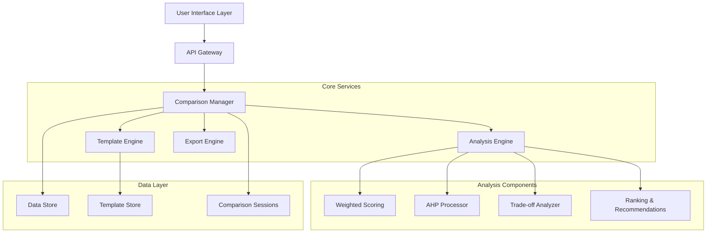

# Design Document: Option Comparison Tool

## Overview

The Option Comparison Tool is a web-based application that helps users make informed decisions by comparing multiple alternatives against user-defined criteria. The system employs established multi-criteria decision analysis (MCDA) methodologies, particularly the Analytic Hierarchy Process (AHP) and weighted scoring models, to provide structured comparisons with clear trade-off explanations.

The tool addresses the common problem of choice paralysis by transforming complex decisions into structured, visual comparisons that highlight key differences and trade-offs between options. Rather than providing single "best" answers, it empowers users to understand the implications of different choices based on their specific constraints and priorities.

## Architecture

The system follows a modular architecture with clear separation between data processing, analysis, and presentation layers:



### Key Architectural Principles

1. **Modularity**: Each analysis method (weighted scoring, AHP) is implemented as a separate, pluggable component
2. **Stateless Processing**: Analysis operations are stateless to support concurrent users and easy scaling
3. **Template-Driven**: Common comparison scenarios use pre-built templates to reduce setup time
4. **Export-Friendly**: All analysis results are structured for easy export in multiple formats

## Components and Interfaces

### 1. Comparison Manager

**Purpose**: Orchestrates the entire comparison workflow from input to output.

**Key Methods**:
- `createComparison(options, constraints, template?)`: Initialize new comparison session
- `updateConstraints(comparisonId, constraints)`: Modify constraint weights and priorities
- `runAnalysis(comparisonId, method)`: Execute specified analysis method
- `getResults(comparisonId, format)`: Retrieve formatted results

**Interfaces**:
```typescript
interface ComparisonSession {
  id: string;
  options: Option[];
  constraints: Constraint[];
  analysisResults?: AnalysisResult;
  template?: Template;
  createdAt: Date;
  updatedAt: Date;
}

interface Option {
  id: string;
  name: string;
  description: string;
  attributes: Record<string, any>;
  metadata?: Record<string, any>;
}

interface Constraint {
  id: string;
  name: string;
  description: string;
  weight: number; // 0-1 scale
  priority: 'required' | 'preferred' | 'nice-to-have';
  type: 'numeric' | 'categorical' | 'boolean';
  scale?: NumericScale | CategoricalScale;
}
```

### 2. Analysis Engine

**Purpose**: Implements multiple MCDA methods for option evaluation and ranking.

**Supported Methods**:
- **Weighted Scoring Model (WSM)**: Simple additive scoring with normalized weights
- **Analytic Hierarchy Process (AHP)**: Pairwise comparison-based method for complex decisions
- **TOPSIS**: Technique for Order Preference by Similarity to Ideal Solution

**Key Methods**:
- `calculateWeightedScores(options, constraints)`: WSM implementation
- `performAHPAnalysis(options, constraints, pairwiseMatrix?)`: AHP with optional pairwise comparisons
- `identifyTradeoffs(options, constraints)`: Analyze competing factors and compromises

### 3. Trade-off Analyzer

**Purpose**: Identifies and explains trade-offs between options across different criteria.

**Core Functionality**:
- **Pareto Analysis**: Identify options that are not dominated by others
- **Sensitivity Analysis**: Show how ranking changes with constraint weight adjustments
- **Trade-off Visualization**: Generate scatter plots and radar charts showing option positioning

**Key Methods**:
- `findParetoFrontier(options, constraints)`: Identify non-dominated solutions
- `calculateSensitivity(options, constraints, weightDeltas)`: Sensitivity analysis
- `generateTradeoffMatrix(options, constraints)`: Create trade-off comparison matrix

### 4. Template Engine

**Purpose**: Provides pre-built comparison templates for common scenarios.

**Built-in Templates**:
- **API Comparison**: REST APIs, GraphQL services, third-party integrations
- **Cloud Services**: AWS vs Azure vs GCP, database services, hosting platforms
- **Tech Stack**: Frontend frameworks, backend technologies, development tools
- **Database Selection**: SQL vs NoSQL, specific database engines
- **Vendor Selection**: SaaS tools, service providers, contractors

**Template Structure**:
```typescript
interface Template {
  id: string;
  name: string;
  description: string;
  domain: string;
  constraints: ConstraintTemplate[];
  suggestedOptions?: OptionTemplate[];
  analysisPreferences: {
    defaultMethod: 'wsm' | 'ahp' | 'topsis';
    visualizations: string[];
    exportFormats: string[];
  };
}

interface ConstraintTemplate {
  name: string;
  description: string;
  type: 'numeric' | 'categorical' | 'boolean';
  defaultWeight: number;
  scale?: any;
  helpText?: string;
}
```

### 5. Export Engine

**Purpose**: Generates comparison reports in multiple formats for sharing and documentation.

**Supported Formats**:
- **PDF Report**: Executive summary with charts and detailed analysis
- **Markdown**: Structured text format for documentation systems
- **JSON**: Raw data for integration with other tools
- **CSV**: Tabular data for spreadsheet analysis

## Data Models

### Core Data Structures

```typescript
// Analysis Results
interface AnalysisResult {
  method: string;
  rankings: OptionRanking[];
  scores: OptionScore[];
  tradeoffs: TradeoffAnalysis[];
  sensitivity: SensitivityAnalysis;
  recommendations: Recommendation[];
  metadata: {
    analysisDate: Date;
    parameters: Record<string, any>;
    confidence: number;
  };
}

interface OptionRanking {
  optionId: string;
  rank: number;
  score: number;
  strengths: string[];
  weaknesses: string[];
  tradeoffSummary: string;
}

interface TradeoffAnalysis {
  constraintA: string;
  constraintB: string;
  correlation: number; // -1 to 1
  description: string;
  affectedOptions: string[];
}

// Visualization Data
interface ComparisonVisualization {
  type: 'table' | 'radar' | 'scatter' | 'bar' | 'matrix';
  data: any;
  config: {
    title: string;
    axes?: string[];
    colors?: string[];
    interactive: boolean;
  };
}
```

### Scoring and Normalization

The system uses multiple normalization approaches based on constraint types:

1. **Numeric Constraints**: Min-max normalization or z-score standardization
2. **Categorical Constraints**: Ordinal mapping with user-defined scales
3. **Boolean Constraints**: Binary scoring (0 or 1)

```typescript
interface NumericScale {
  min: number;
  max: number;
  unit?: string;
  direction: 'higher-better' | 'lower-better';
  normalizationMethod: 'min-max' | 'z-score';
}

interface CategoricalScale {
  values: string[];
  scores: number[]; // Corresponding numeric scores
  ordered: boolean;
}
```

## Correctness Properties

*A property is a characteristic or behavior that should hold true across all valid executions of a system—essentially, a formal statement about what the system should do. Properties serve as the bridge between human-readable specifications and machine-verifiable correctness guarantees.*

Based on the prework analysis of acceptance criteria, the following properties ensure the system behaves correctly across all valid inputs:

### Property 1: Data Persistence Round Trip
*For any* valid option or constraint data, storing it in the system and then retrieving it should return data that is equivalent to the original input.
**Validates: Requirements 1.1, 1.2**

### Property 2: Constraint Validation
*For any* option with missing required fields, the system should identify and report all missing essential information.
**Validates: Requirements 1.3**

### Property 3: Capacity Constraints
*For any* comparison session with 2-10 options, the system should accept and process all options, and for sessions outside this range, the system should enforce appropriate limits.
**Validates: Requirements 1.4**

### Property 4: Constraint Categorization
*For any* constraint with a specified importance level, the system should correctly categorize it as required, preferred, or nice-to-have.
**Validates: Requirements 2.1**

### Property 5: Scoring Consistency
*For any* set of options and constraints, the system should calculate scores for all options, and options with identical attributes should receive identical scores.
**Validates: Requirements 2.2, 5.1**

### Property 6: Conflict Detection
*For any* set of constraints that are logically conflicting, the system should identify and highlight these conflicts.
**Validates: Requirements 2.3**

### Property 7: Trade-off Identification
*For any* comparison with options that have competing strengths, the system should identify trade-offs and explain what is sacrificed when choosing each option.
**Validates: Requirements 3.1, 3.2, 3.3**

### Property 8: Trade-off Quantification
*For any* identified trade-off, the system should provide numeric measures or relative rankings where quantification is possible.
**Validates: Requirements 3.4**

### Property 9: Multi-format Output
*For any* completed comparison, the system should generate results in all specified formats (table, pros/cons lists, summary cards).
**Validates: Requirements 4.1**

### Property 10: Differentiator Highlighting
*For any* comparison results, the system should identify and highlight the most significant differences between options.
**Validates: Requirements 4.2**

### Property 11: Categorical Organization
*For any* pros and cons display, items should be organized and grouped by their corresponding constraint categories.
**Validates: Requirements 4.3**

### Property 12: Executive Summary Generation
*For any* comparison, the system should generate an executive summary that includes top recommendations based on the specified constraints.
**Validates: Requirements 4.4**

### Property 13: Tie-breaking Explanation
*For any* comparison where multiple options have similar scores, the system should provide explanations of the factors used to break ties.
**Validates: Requirements 5.2**

### Property 14: Recommendation Reasoning
*For any* recommendation made by the system, it should include clear reasoning explaining why that option was recommended.
**Validates: Requirements 5.3**

### Property 15: Dynamic Recalculation
*For any* change to constraint weights or priorities, the system should recalculate rankings and update recommendations to reflect the changes.
**Validates: Requirements 5.4, 6.1, 6.2**

### Property 16: Impact Analysis
*For any* constraint modification, the system should identify and highlight which options are most affected by the change.
**Validates: Requirements 6.3**

### Property 17: What-if Analysis
*For any* temporary parameter adjustment, the system should support scenario analysis without permanently modifying the base comparison.
**Validates: Requirements 6.4**

### Property 18: Template Functionality
*For any* selected template, the system should pre-populate relevant constraint categories and suggest appropriate options for that domain.
**Validates: Requirements 7.2, 7.3**

### Property 19: Custom Constraint Support
*For any* scenario where templates are insufficient, the system should allow users to define custom constraints with appropriate validation.
**Validates: Requirements 7.4**

### Property 20: Export Completeness
*For any* comparison export, the generated output should include all analysis details, reasoning, and be available in all specified formats (PDF, markdown, JSON).
**Validates: Requirements 8.1, 8.2**

### Property 21: Sharing and Persistence
*For any* comparison session, the system should generate shareable artifacts and preserve the comparison state for future reference and updates.
**Validates: Requirements 8.3, 8.4**

<function_calls>
<invoke name="prework">
<parameter name="featureName">option-comparison-tool

## Error Handling

The system implements comprehensive error handling across all components:

### Input Validation Errors
- **Invalid Option Data**: Missing required fields, invalid data types, or malformed attributes
- **Constraint Conflicts**: Logically inconsistent constraints or invalid weight assignments
- **Capacity Violations**: Too many or too few options for comparison

### Analysis Errors
- **Insufficient Data**: Not enough information to perform meaningful analysis
- **Calculation Failures**: Division by zero, invalid mathematical operations, or convergence issues in AHP
- **Template Mismatches**: Selected template incompatible with provided data

### System Errors
- **Export Failures**: File generation errors, format conversion issues, or storage problems
- **Session Management**: Invalid session IDs, expired sessions, or concurrent modification conflicts
- **External Dependencies**: Template loading failures or third-party service unavailability

### Error Response Strategy
1. **Graceful Degradation**: Provide partial results when possible rather than complete failure
2. **Clear Messaging**: User-friendly error messages with actionable guidance
3. **Fallback Options**: Alternative analysis methods when primary method fails
4. **Recovery Mechanisms**: Automatic retry for transient failures, manual recovery options for persistent issues

## Testing Strategy

The testing approach combines unit testing for specific functionality with property-based testing for comprehensive validation of system behavior.

### Unit Testing Focus
- **Template Validation**: Verify each built-in template (APIs, cloud services, tech stacks, databases) loads correctly and contains expected constraints
- **Export Format Generation**: Test each export format (PDF, markdown, JSON, CSV) produces valid output
- **Edge Cases**: Empty option lists, single-option comparisons, extreme constraint weights
- **Error Conditions**: Invalid inputs, malformed data, system failures
- **Integration Points**: API endpoints, data persistence, external service interactions

### Property-Based Testing Configuration
- **Testing Framework**: Use QuickCheck-style property testing library appropriate for the chosen implementation language
- **Test Iterations**: Minimum 100 iterations per property test to ensure comprehensive input coverage
- **Data Generators**: Smart generators that create realistic options, constraints, and comparison scenarios
- **Shrinking Strategy**: When failures occur, automatically reduce input complexity to find minimal failing cases

### Property Test Implementation
Each correctness property will be implemented as a property-based test with the following structure:

```typescript
// Example property test structure
describe('Feature: option-comparison-tool, Property 1: Data Persistence Round Trip', () => {
  it('should preserve all data through store/retrieve cycle', () => {
    forAll(optionGenerator, constraintGenerator, (options, constraints) => {
      const stored = comparisonEngine.store(options, constraints);
      const retrieved = comparisonEngine.retrieve(stored.id);
      
      return deepEqual(retrieved.options, options) && 
             deepEqual(retrieved.constraints, constraints);
    });
  });
});
```

### Test Data Generation Strategy
- **Realistic Options**: Generate options with varied attributes, realistic value ranges, and domain-appropriate characteristics
- **Diverse Constraints**: Create constraints with different types (numeric, categorical, boolean), weights, and priorities
- **Edge Case Coverage**: Include boundary conditions, empty values, extreme weights, and conflicting requirements
- **Domain-Specific Scenarios**: Generate test cases specific to each template domain (API features, cloud service characteristics, etc.)

### Performance and Load Testing
- **Scalability Testing**: Verify system performance with maximum supported options (10 per comparison)
- **Concurrent User Testing**: Ensure system handles multiple simultaneous comparisons
- **Analysis Performance**: Measure and validate analysis completion times for different comparison sizes
- **Export Performance**: Test export generation time for various formats and comparison complexities

The dual testing approach ensures both correctness (property tests verify universal behaviors) and reliability (unit tests catch specific edge cases and integration issues). Property tests provide confidence that the system behaves correctly across all possible inputs, while unit tests validate specific examples and error conditions that are critical for user experience.